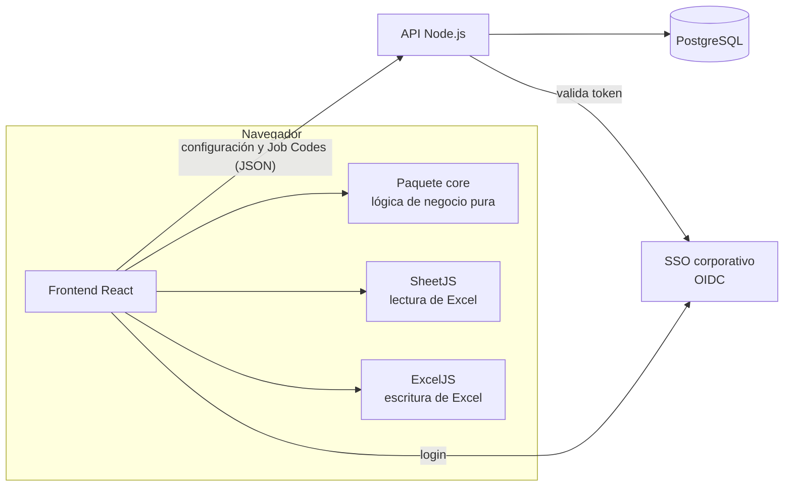

# 01 · Stack de tecnologías

## Arquitectura



El principio central es que **los timesheets se procesan en el navegador**. El servidor solo guarda la configuración compartida (roster, parámetros, palabras clave, alias, Job Codes) y su historial. Así no se suben datos de horas a ningún servidor, y el backend se mantiene pequeño.

## Componentes

| Capa | Tecnología recomendada | Por qué |
|---|---|---|
| Lenguaje | **TypeScript** (en todo el proyecto) | Las reglas manejan muchos campos y tipos; el tipado evita errores de mapeo de columnas. |
| Lógica de negocio | Paquete **`core`** en TS puro, sin DOM ni red | Es lo más crítico. Se prueba de forma aislada y podría reutilizarse en un CLI o en el servidor. Portar desde `referencia/core.js`. |
| Frontend | **React 18 + Vite** | Estándar, rápido de levantar y fácil de mantener por cualquier DEV del equipo. |
| UI | **Tailwind CSS** + componentes accesibles (p. ej. shadcn/ui o Radix) | Tablas, tabs, selects y diálogos accesibles sin construirlos desde cero. |
| Estado / datos | **TanStack Query** para la API y estado local con `useReducer` o Zustand | Autosave de la configuración con reintentos y un estado de guardado visible. |
| Lectura de Excel | **SheetJS (`xlsx`) 0.20.x**, instalado desde `https://cdn.sheetjs.com` | Lee rápido libros grandes y devuelve los valores cacheados de las fórmulas. **No usar 0.18.5 de npm:** tiene vulnerabilidades conocidas (CVE-2023-30533 y CVE-2024-22363) al leer archivos manipulados. |
| Escritura de Excel | **ExcelJS 4.4** | Soporta fórmulas, estilos, formato condicional, validación de datos (listas Sí/No), filtros y paneles inmovilizados. SheetJS Community no escribe estilos. |
| Backend | **Node.js 20 LTS + Fastify** (o NestJS si el equipo ya lo usa) | Pocos endpoints. Comparte los tipos TS con el frontend. |
| Base de datos | **PostgreSQL 15+** con **Prisma** | Configuración versionada e historial de cambios. Volumen mínimo. |
| Autenticación | **SSO corporativo vía OIDC** (Microsoft Entra ID o Google Workspace, según lo que use la empresa) | Solo personas de la organización. Los roles salen de grupos del IdP o de una tabla propia. |
| Pruebas | **Vitest** (core), **Playwright** (e2e), **LibreOffice headless** en CI para recalcular el Excel generado | Asegura que las fórmulas del Excel dan los mismos valores que el core y sin errores. |
| Calidad | ESLint, Prettier, Husky + lint-staged | Convenciones del equipo. |
| Despliegue | **Docker**. Frontend estático detrás de Nginx o en el hosting interno; API en contenedor | Simple de operar. |
| CI/CD | GitHub Actions (o el pipeline del equipo) | Lint, tests, build, prueba de recálculo del Excel y despliegue. |

## Estructura de repositorio sugerida (monorepo)

```
timesheet-report/
├─ packages/
│  └─ core/                 # lógica pura (TS) + tests Vitest + fixtures anonimizados
│     ├─ src/
│     │  ├─ parse.ts        # lectura de libros (recibe el objeto de SheetJS)
│     │  ├─ normalize.ts    # textos, fechas, Job Codes, personas
│     │  ├─ weeks.ts        # semanas y etiquetas
│     │  ├─ rules.ts        # tarea cuenta / no cuenta, palabras clave
│     │  ├─ compute.ts      # validación, horas PM, incidencias
│     │  ├─ excel.ts        # construcción del libro con ExcelJS
│     │  └─ types.ts
│     └─ test/
├─ apps/
│  ├─ web/                  # React + Vite
│  └─ api/                  # Fastify + Prisma
├─ docs/                    # esta carpeta
└─ docker-compose.yml
```

## API mínima

| Método | Ruta | Rol | Descripción |
|---|---|---|---|
| GET | `/api/config` | PM, Admin | Configuración vigente y su `version`. |
| PUT | `/api/config` | ver `docs/06` | Reemplaza la configuración. Exige `If-Match: <version>` y responde 409 si alguien la cambió antes. |
| GET | `/api/jobcodes` | PM, Admin | Lista de Job Codes. |
| PUT | `/api/jobcodes` | PM, Admin | Reemplaza la lista, por ejemplo al subir el Excel del cliente. |
| GET | `/api/config/history` | Admin | Historial de cambios: quién, cuándo y diff. |

El esquema de la configuración es el de `config/config-inicial.json`:

```ts
type Config = {
  params: { minDia: number; maxDia: number; umbral: number; pmNormal: number; pmAlta: number };
  keywords: string[];                       // respetar espacios al inicio/fin
  roster: { dev: string; equipo: string; pm: string;
            tipo: "Fijo" | "On demand" | "PM" | "No incluir";
            cuentaPM: "Sí" | "No" }[];
  aliases: { de: string; a: string }[];
};
type JobCode = { client: string; jobCode: number | string };
```

## Alternativas consideradas

| Opción | Por qué no es la principal |
|---|---|
| Plantilla Excel con Power Query | Difícil de probar y versionar. El cálculo por equipo y por día, con umbral, es engorroso en M. Cada PM tendría su copia y la configuración se desincronizaría. |
| Procesar los Excel en el servidor | Obliga a subir los timesheets (datos personales y horas) y a gestionar su almacenamiento. No aporta beneficios para este volumen. |
| Supabase en lugar de API + PostgreSQL propios | Válido si el equipo ya lo usa: cubre autenticación, base de datos y control de acceso a nivel de fila. Cambia la capa de API, no el core. |
