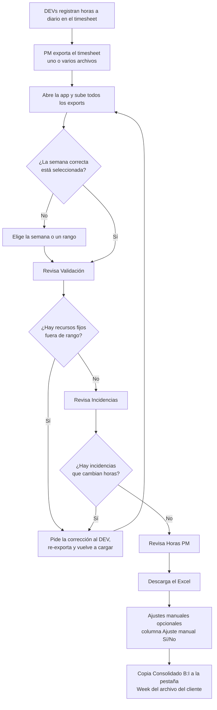

# 02 · Flujo de trabajo

Este documento tiene tres partes: cómo usa el PM la aplicación cada semana, qué hace la aplicación con los datos y en qué orden conviene construirla.

## A. Flujo semanal del PM

Pasos en detalle:

1. **Registro diario.** Cada DEV llena su pestaña del timesheet. Esto no cambia.
2. **Export.** Cada PM exporta el timesheet de su equipo. La aplicación acepta los exports de todos los equipos a la vez, así que un solo PM puede consolidar todo.
3. **Carga.** El PM arrastra los archivos. Si cambió la lista de Job Codes, sube también el archivo del cliente para actualizarla.
4. **Semana.** Por defecto se selecciona la más reciente. Las semanas se recortan al mes, igual que las pestañas Week1 a Week5 del archivo del cliente.
5. **Validación.** Para los fijos, de 8 a 9 h por día hábil (40–45 h en una semana completa). Para los on demand, solo el total semanal.
6. **Incidencias.** Se corrigen en el timesheet de origen y se vuelve a cargar. La aplicación no corrige datos por su cuenta, salvo lo que indica cada incidencia: los alias se aplican y los subtotales se ignoran.
7. **Horas PM.** El PM revisa el reparto por equipo y día.
8. **Descarga.** Excel con fórmulas. Si una reunión se clasificó mal, se corrige con el ajuste manual en el propio Excel y todo se recalcula.
9. **Entrega.** Las columnas B:I del Consolidado tienen el mismo formato que las pestañas Week del archivo del cliente.

## B. Flujo de procesamiento de datos

```mermaid
flowchart LR
  P1[1. Leer libros<br/>todas las pestañas] --> P2[2. Detectar encabezados<br/>y mapear columnas]
  P2 --> P3[3. Clasificar filas<br/>vacía · subtotal · incompleta · dato]
  P3 --> P4[4. Filtrar por rango<br/>de la semana]
  P4 --> P5[5. Identificar persona<br/>en el roster]
  P5 --> P6[6. Normalizar Job Code<br/>alias · RKD · lista]
  P6 --> P7[7. Marcar si la tarea<br/>cuenta para el PM]
  P7 --> P8[8. Detectar duplicados<br/>e incidencias]
  P8 --> P9[9. Validación<br/>por persona y día]
  P9 --> P10[10. Horas PM<br/>por equipo y día hábil]
  P10 --> P11[11. Vista previa<br/>y Excel con fórmulas]
```

Cada paso está especificado en `03-reglas-de-negocio.md`, con la misma numeración de secciones.

## C. Plan de desarrollo sugerido

| Fase | Entregable | Criterio de cierre |
|---|---|---|
| F0 · Setup | Monorepo, CI, lint, Vitest, fixtures anonimizados | El pipeline corre en verde. |
| F1 · Core | Lectura, normalización, reglas, validación, horas PM e incidencias en `packages/core` | Pasan todos los casos de `05-casos-de-prueba.md`. |
| F2 · Excel | Generación del libro según `04-excel-de-salida.md` | Recalculado con LibreOffice en CI: 0 errores, y los valores coinciden con el core. |
| F3 · UI | Carga, semana, pestañas Validación / Horas PM / Incidencias, resumen y descarga | La prueba e2e con Playwright sube los fixtures y descarga el Excel. |
| F4 · Configuración y auth | API, base de datos, SSO, edición de configuración con autosave e historial | Dos usuarios editando a la vez no se pisan (control por `version`). |
| F5 · Paralelo | 2 semanas usando la app junto al proceso manual | Diferencias documentadas y aprobadas por el negocio. |
| F6 · Lanzamiento | Guía corta para PMs y retiro del proceso manual | Los PMs generan su reporte sin ayuda. |

Recomendación: comparar el `core` contra el prototipo (`referencia/core.js`) con los mismos fixtures en cada fase. Una diferencia indica un error del port o una regla que cambió con aprobación del negocio. En el segundo caso, se actualiza esta documentación.
